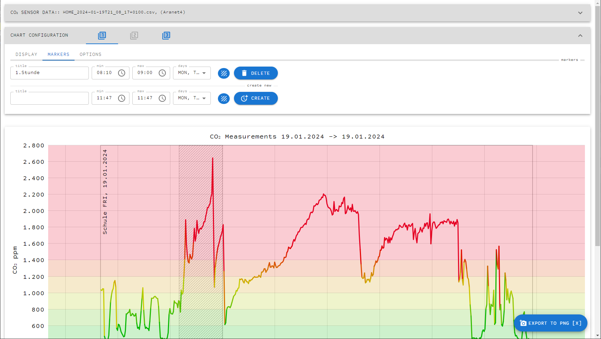
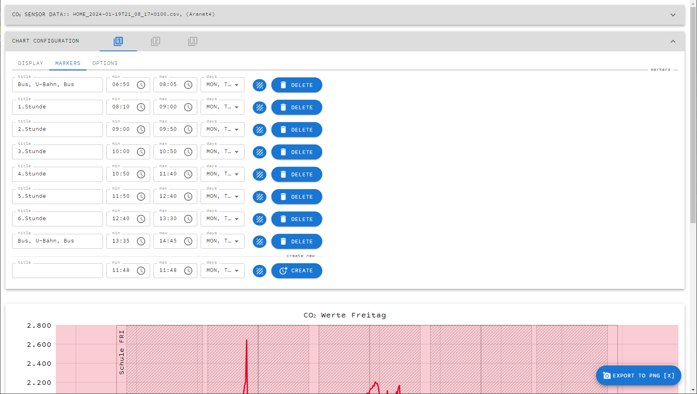
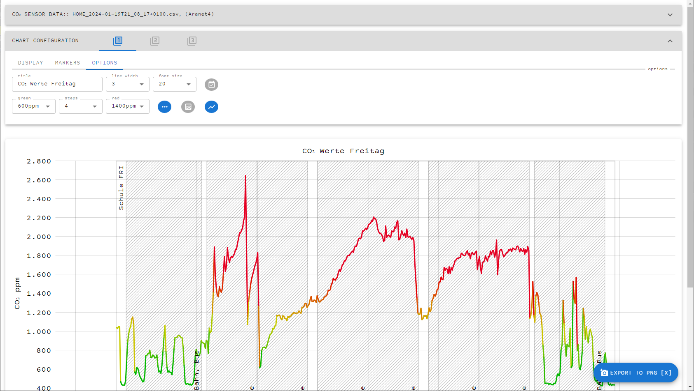
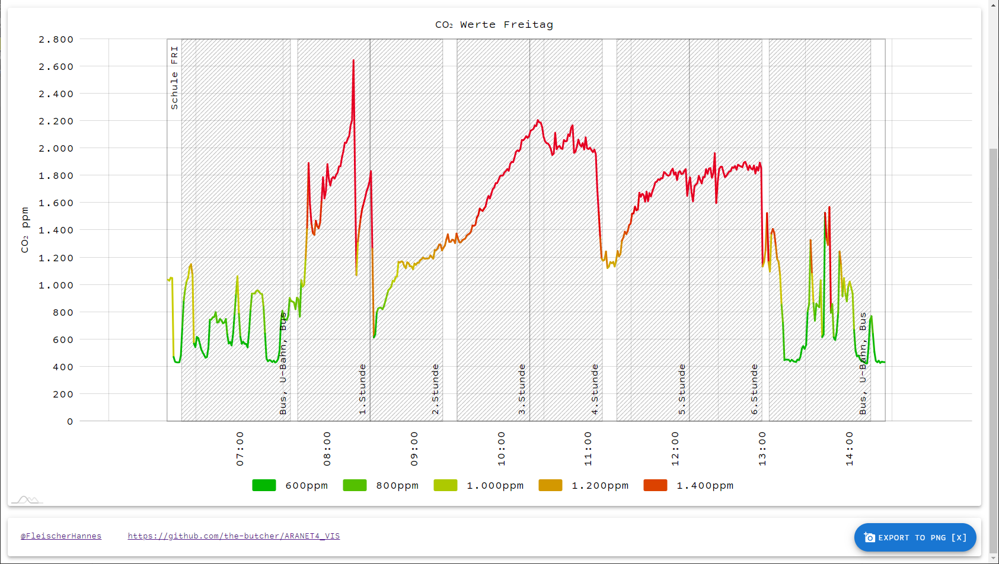

# ARANET4_VIS

This is a utility web app offering the possibility to export specific portions of Aranet4, SmartAir and Inkbird co2 data. Data display can be limited to specific times and weekdays. Markers can be added to the chart to indicate areas of interest.

A live version of the app can be found at [https://the-butchers.at/aranet4_vis/](https://the-butchers.at/aranet4_vis/)

Please refer to the instructions below to get started.

## 1) Import CSV Data

Start by exporting CSV data from your Aranet4, SmartAir or Inkbird device. Export CSV from you device or app as suitable to a location of your choice, then import the CSV file into this app by pressing the button shown in the image or dragging the file onto the button.

When the import succeeds, the data contained in the CSV file will display in the web app. By default, a maximum of the last 7 days is shown. The overall range of data shown in the chart can be specified with the "date range" setting by picking "min (incl)" and "max (incl)" settings suitable for your needs.

 A small overview helps finding an appropriate data range.

 

## 2) Specify chart display ranges

You can now limit the daily times of data that you want to include in your chart. Please configure one or more display ranges to include. You can also limit data to specific weekdays, i.e. when you want to show specific hours of workdays or schoodays only.

Once configured, the data in your chart will be broken into distinct sections of data.

## 3) Specify chart marker ranges

Create chart markers to indicate sections of interest within your data. As with display ranges you can choose weekdays for marker ranges. Combining display range weekdays and marker range weekdays give the possibility to create a flexible set of chart data being included.

Markers will show in the chart for better readability.

Add more markers if required.

It is possible to specify up to three sets of configuration, i.e. to hold the hours of different schools. You can swith between those configurations with the buttons labelled "1", "2" and "3".

## 4) Change chart options

Adapt chart options as suitable. You can choose to display the background gradient display of the chart, or change the display of the curve. If required, any dates can be hidden in the chart.

## 5) Export chart

Use the "EXPORT TO PNG" button or the keyboard shortcur "X" to export your chart as image.

