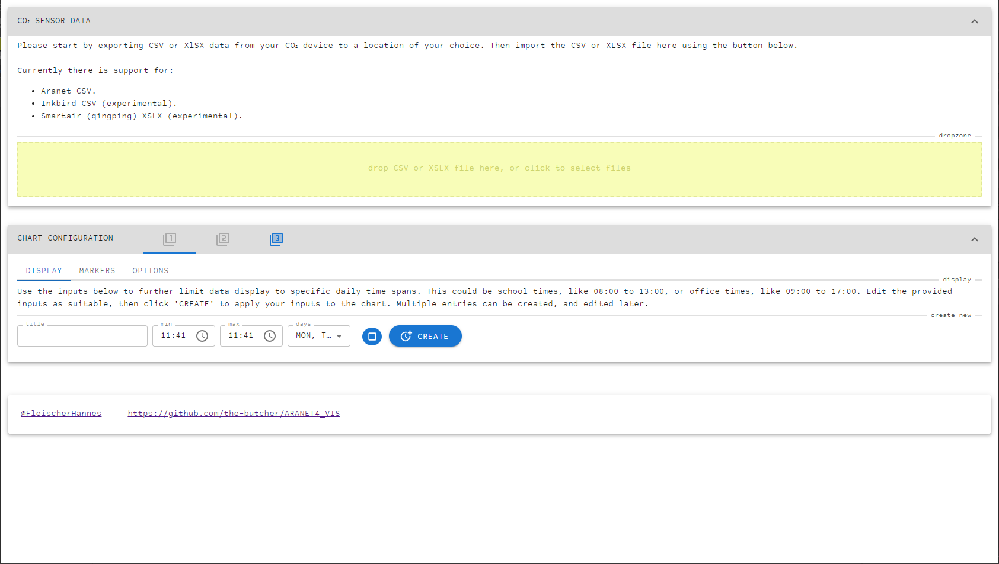
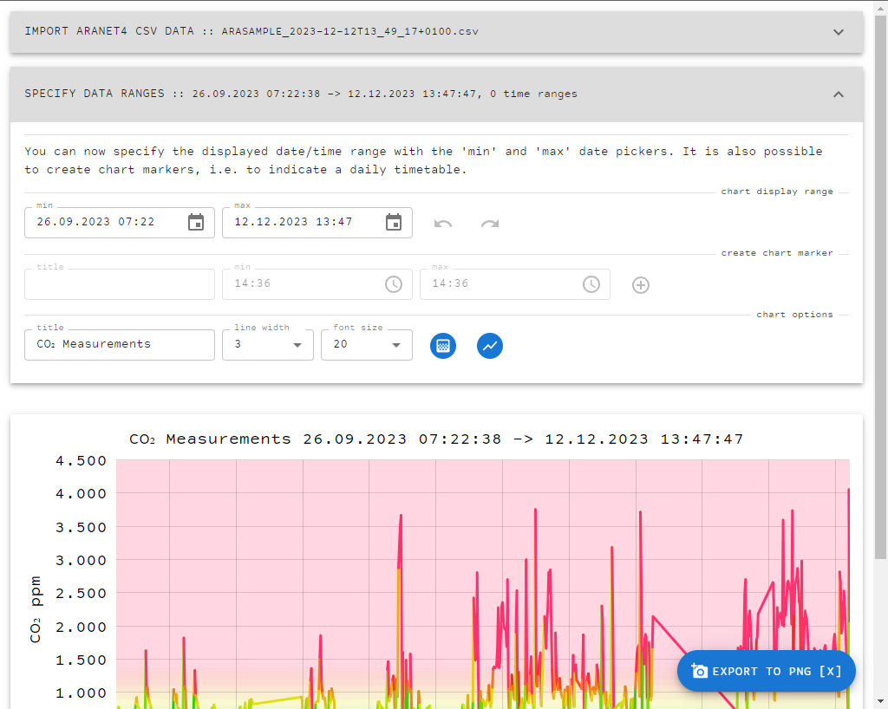
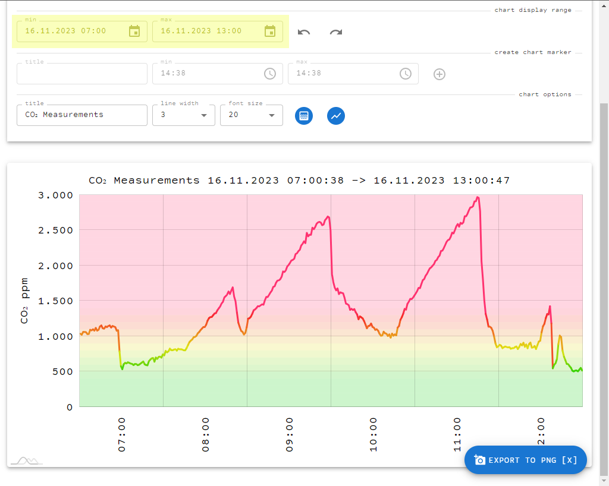
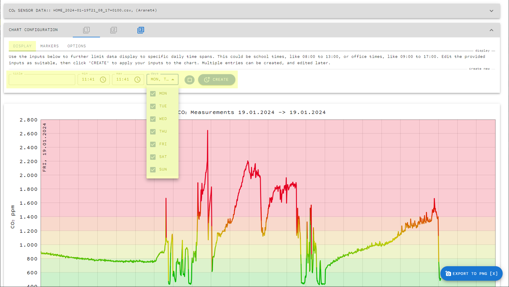
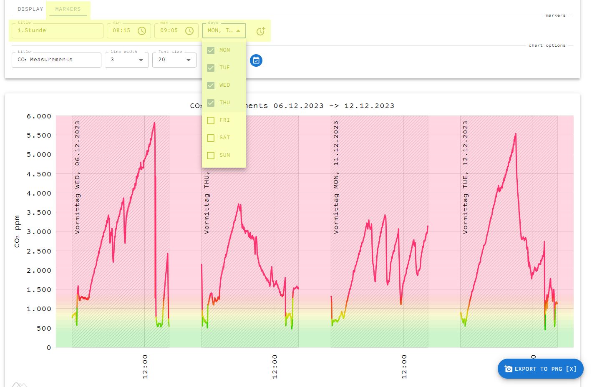
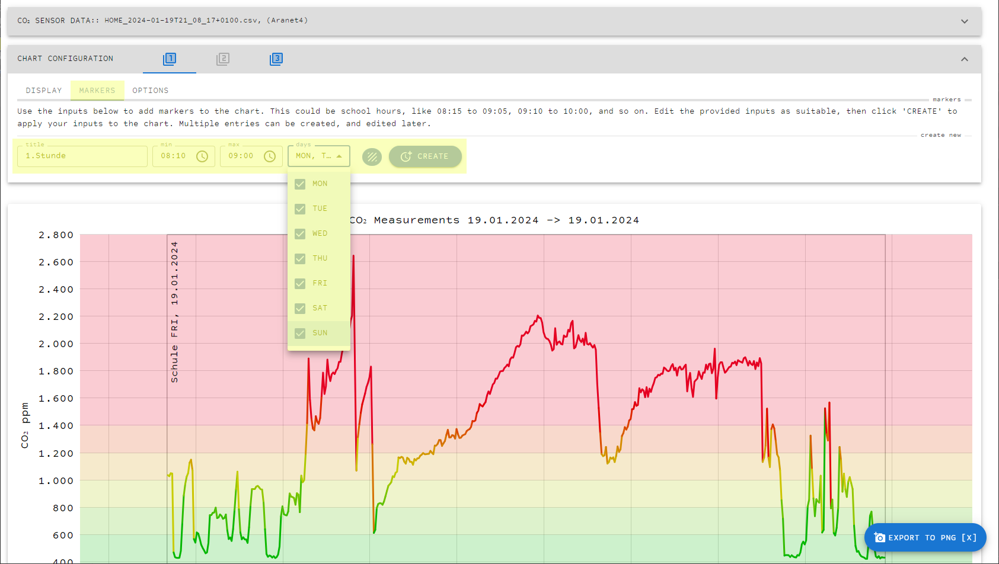

# ARANET4_VIS

This is a utility web app offering the possibility to export specific portions of Aranet4 co2 data. Markers can be added to the chart to indicate areas of interest.

Please refer to the instructions below to get started.

## 1) Import CSV Data

Start by exporting CSV data from your Aranet4 device. Find and press the export CSV icon in your Aranet App. Export the CSV file to a location of your choice, then import the CSV file into this app by pressing the button shown in the image or dragging the file onto the button.

When the import succeeds, the data contained in the CSV file should display in the web app

## 2) Specify chart display range

Use the chart display range area to specifiy the portion of the data you want to show.

## 3) Add chart markers

Create chart markers to indicate sections of interest within your data.

Markers will show in the chart for better readability.

## 4) Change chart options

Adapt chart options as suitable.

## 5) Export chart

Use the "EXPORT TO PNG" button or the keyboard shortcur "X" to export your chart as image.